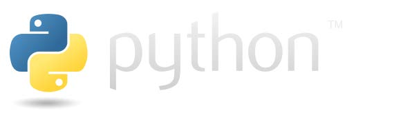

# Mastering Python: An In-Depth Guide
Python is a versatile and powerful programming language known for its readability and straightforward syntax. It is a favorite among developers in diverse fields, from web development to data science, due to its simplicity and the vast ecosystem of libraries and frameworks it supports.
